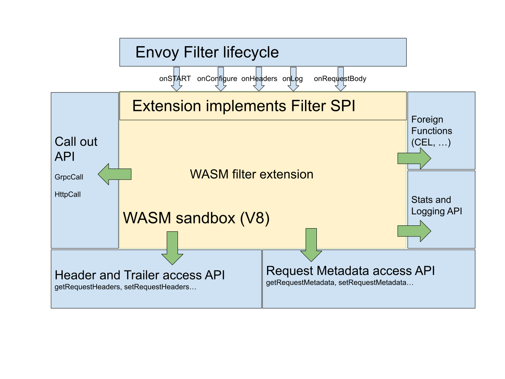

<!-- START doctoc generated TOC please keep comment here to allow auto update -->
<!-- DON'T EDIT THIS SECTION, INSTEAD RE-RUN doctoc TO UPDATE -->
**Table of Contents**  *generated with [DocToc](https://github.com/thlorenz/doctoc)*

- [envoy wasm plugins](#envoy-wasm-plugins)
- [wasm](#wasm)
  - [wasme工具](#wasme%E5%B7%A5%E5%85%B7)
  - [命令行安装](#%E5%91%BD%E4%BB%A4%E8%A1%8C%E5%AE%89%E8%A3%85)
  - [初始化示例项目](#%E5%88%9D%E5%A7%8B%E5%8C%96%E7%A4%BA%E4%BE%8B%E9%A1%B9%E7%9B%AE)
  - [示例项目功能](#%E7%A4%BA%E4%BE%8B%E9%A1%B9%E7%9B%AE%E5%8A%9F%E8%83%BD)
  - [编译](#%E7%BC%96%E8%AF%91)
- [wasm文件挂载](#wasm%E6%96%87%E4%BB%B6%E6%8C%82%E8%BD%BD)
  - [创建为configmap](#%E5%88%9B%E5%BB%BA%E4%B8%BAconfigmap)
  - [patch Annotation](#patch-annotation)
- [envoy wasm filter](#envoy-wasm-filter)
  - [创建envoy filter](#%E5%88%9B%E5%BB%BAenvoy-filter)
  - [验证](#%E9%AA%8C%E8%AF%81)
- [Ref](#ref)

<!-- END doctoc generated TOC please keep comment here to allow auto update -->


> 针对istio 1.10版本验证。注意网上部分文章已经不适配1.10版本了。

本文只会简单介绍envoy web assembly以及一个Demo实例，不会详细介绍 envoy web assembly原理或编程。

本文将使用solo开发的[wasme](https://github.com/solo-io/wasm)初始化一个assemblyscript类型的项目，并执行编译，得到wasm二进制文件。然后通过注解，将wasm文件以configmap的形式，自动挂载到istio-proxy容器中。最后创建WASM类型的envoy filter，将规则下发给对应Pod的envoy。

# envoy wasm plugins

envoy有着很强的可配置性，但总归有一些功能是没有实现的，那么如何对envoy进行扩展呢？

有2种做法：一个是直接修改envoy源码，另一个是通过Web Assembly插件。

直接修改源码的好处是envoy native，性能最好，但带来了可维护性的降低，不利于未来升级，另外也需要使用c++进行编码，对开发人员有一定的要求。

相对来说，Web Assembly的好处就比较多了，如下是banzaicloud总结的几个点：

- Agility - filters can be dynamically loaded into the running Envoy process without the need to stop or re-compile.
- Maintainability - we don’t have to change the Envoy’s codebase to extend its functionality.
- Diversity - popular programming languages such as C/C++ and Rust can be compiled into WASM, thus developers can implement filters using their programming language of choice.
- Reliability and isolation - filters are deployed into a VM (sandbox), therefore are isolated from the hosting Envoy process itself (e.g. when the WASM filter crashes it will not impact the Envoy process).
- Security - since filters communicate with the host (Envoy Proxy) through a well-defined API, they have access to and can modify only a limited number of connection or request properties.

目前Envoy 提供了如下几种语言的 Web Assembly SDK：

- C++
- Rust
- AssemblyScript
- Go - still experimental

当然，Web Assembly也有其缺点：

- 性能降低，只有原生c++的70%
- 内存使用增加，毕竟运行了一个v8的虚拟机



# wasm

下面介绍如何使用wasme制作wasm二进制文件。

## wasme工具

[wasme](https://github.com/solo-io/wasm)是solo.io公司开发的工具，可以很方便的用来开发和管理 envoy WASM filter。其设计理念和docker是类似的，会有针对本地的build，针对云端的push等；类似docker hub，solo.io也维护了[Webassembly Hub](https://webassemblyhub.io/)作为插件市场。

## 命令行安装

wasme安装参考[官网](https://docs.solo.io/web-assembly-hub/latest/tutorial_code/)，步骤如下：

```bash
curl -sL https://run.solo.io/wasme/install | sh
export PATH=$HOME/.wasme/bin:$PATH
```

我这里安装的是0.0.33版本。

## 初始化示例项目

wasme init 可以初始化一个针对WASM支持语言（cpp/rust/assemblyscript/tinyGo）的项目。这里示例使用的是assemblyscript。工具宣称目前只支持到istio 1.9，实测1.10版本也是支持的。

```bash
$ wasme init ./new-filter
✔ assemblyscript
✔ gloo:1.3.x, gloo:1.5.x, gloo:1.6.x, istio:1.5.x, istio:1.6.x, istio:1.7.x, istio:1.8.x, istio:1.9.x
INFO[0005] extracting 1812 bytes to /home/hubottle/wasm/new-filter
```

## 示例项目功能

初始化示例项目的功能为http response自动添加header：hello，value默认为world，如果用户设置了 configuration， 则值设置为 configuration的内容。

```ts
export * from "@solo-io/proxy-runtime/proxy";
import { RootContext, Context, RootContextHelper, ContextHelper, registerRootContext, FilterHeadersStatusValues, stream_context } from "@solo-io/proxy-runtime";

class AddHeaderRoot extends RootContext {
  configuration : string;

  onConfigure(): bool {
    let conf_buffer = super.getConfiguration();
    let result = String.UTF8.decode(conf_buffer);
    this.configuration = result;
    return true;
  }

  createContext(): Context {
    return ContextHelper.wrap(new AddHeader(this));
  }
}

class AddHeader extends Context {
  root_context : AddHeaderRoot;
  constructor(root_context:AddHeaderRoot){
    super();
    this.root_context = root_context;
  }
  onResponseHeaders(a: u32): FilterHeadersStatusValues {
    const root_context = this.root_context;
    if (root_context.configuration == "") {
      stream_context.headers.response.add("hello", "world!");
    } else {
      stream_context.headers.response.add("hello", root_context.configuration);
    }
    return FilterHeadersStatusValues.Continue;
  }
}

registerRootContext(() => { return RootContextHelper.wrap(new AddHeaderRoot()); }, "add_header");
```

## 编译

`npm install && npm run asbuild` 进行编译。编译得到的文件在 `build` 目录下，其中 `optimized.wasm` 文件较小，是优化后的二进制，而 `untouched.wasm` 较大，包含了debug信息。

注意，这里并没有使用 wasme build/push 进行管理，主要是考虑国内访问外网的问题，下面envoy filter将使用local模式而非remote模式。

```bash
$ npm install && npm run asbuild
> asbuild:untouched
> asc assembly/index.ts -b build/untouched.wasm --use abort=abort_proc_exit -t build/untouched.wat --validate --sourceMap --debug


> asbuild:optimized
> asc assembly/index.ts -b build/optimized.wasm --use abort=abort_proc_exit -t build/optimized.wat --validate --sourceMap --optimize
$ ls build/
optimized.wasm  optimized.wasm.map  optimized.wat  untouched.wasm  untouched.wasm.map  untouched.wat
```

# wasm文件挂载

目标：将wasm文件挂载到目标Pod的istio-proxy容器中。

## 创建为configmap

将optimized.wasm创建为一个configmap。注意，生产上不要这么做，如果量比较大，有可能写满etcd，可以考虑将wasm文件上传到s3，然后将该文件挂载到sidecar容器，或者直接使用remote http的方式。

```bash
$ kubectl create cm example-filter --from-file=optimized.wasm
```

## patch Annotation

为Deployment Template增加如下2个注解：

```
sidecar.istio.io/userVolume: '[{"name":"wasmfilters-dir","configMap": {"name": "example-filter"}}]'
sidecar.istio.io/userVolumeMount: '[{"mountPath":"/var/local/lib/wasm-filters","name":"wasmfilters-dir"}]'
```

istiod会依据这2个注解，将名为 `example-filter` 的configmap，挂载到istio-proxy 容器的 `/var/local/lib/wasm-filters` 目录下。

```bash
$ kubectl create deployment httpbin --image docker.io/kennethreitz/httpbin
$ kubectl patch deployment httpbin -p '{"spec":{"template":{"metadata":{"annotations":{"sidecar.istio.io/userVolume":"[{\"name\":\"wasmfilters-dir\",\"configMap\": {\"name\": \"example-filter\"}}]","sidecar.istio.io/userVolumeMount":"[{\"mountPath\":\"/var/local/lib/wasm-filters\",\"name\":\"wasmfilters-dir\"}]"}}}}}'
```

Pod重新创建后，在istio-proxy的 `/var/local/lib/wasm-filters` 下可以查看到 `optimized.wasm` 文件。

# envoy wasm filter

接下来是创建 envoy wasm filter，通知envoy加载 wasm 插件。

## 创建envoy filter

其中：

- proxyVersion与istio-proxy版本保持一致
- root_id需要与 wasm registerRootContext保持一致
- filename需要与前面Annotation保持一致
- workloadSelector设置为目标Pod的label

如下envoy filter适应于 istio 1.10版本，Ref部分有多篇文章使用的是旧版本的配置，不适应于1.10版本（未验证是否适应于其他istio版本）。

```yaml
apiVersion: networking.istio.io/v1alpha3
kind: EnvoyFilter
metadata:
  name: examplefilter
spec:
  configPatches:
  - applyTo: HTTP_FILTER
    match:
      context: SIDECAR_INBOUND
      proxy:
        proxyVersion: '^1\.10.*'
      listener:
        portNumber: 80
        filterChain:
          filter:
            name: envoy.filters.network.http_connection_manager
            subFilter:
              name: envoy.filters.http.router
    patch:
      operation: INSERT_BEFORE
      value:
        name: envoy.filters.http.wasm
        typed_config:
          "@type": type.googleapis.com/udpa.type.v1.TypedStruct
          type_url: type.googleapis.com/envoy.extensions.filters.network.wasm.v3.Wasm
          value:
            config:
              root_id: add_header
              vm_config:
                code:
                  local:
                    filename: /var/local/lib/wasm-filters/optimized.wasm
                runtime: envoy.wasm.runtime.v8
                vm_id: "my_vm_id"
                allow_precompiled: false
  workloadSelector:
    labels:
      app: httpbin
```

## 验证

登录到其他服务网格上的容器，请求 httpbin/headers ，可以看到客户端请求时没有携带 hello header，但是应答的报文是携带了的，envoy filter生效了。

```bash
[root@debian-77dc9c5f4f-htvc2 /]# curl -i httpbin/headers
HTTP/1.1 200 OK
server: envoy
date: Wed, 21 Jul 2021 15:08:48 GMT
content-type: application/json
content-length: 526
access-control-allow-origin: *
access-control-allow-credentials: true
x-envoy-upstream-service-time: 5
hello: world!

{
  "headers": {
    "Accept": "*/*",
    "Host": "httpbin",
    "User-Agent": "curl/7.29.0",
    "X-B3-Parentspanid": "6b1605afd18ad4fe",
    "X-B3-Sampled": "0",
    "X-B3-Spanid": "33bc8d7277665508",
    "X-B3-Traceid": "6ccb755e06d510386b1605afd18ad4fe",
    "X-Envoy-Attempt-Count": "1",
    "X-Forwarded-Client-Cert": "By=spiffe://cluster.local/ns/istio-demo/sa/httpbin;Hash=4de05d86f84ae38da23ff1f0961f43bb1dc94a45207ffc388dee687c2fb34837;Subject=\"\";URI=spiffe://cluster.local/ns/istio-demo/sa/default"
  }
}
```


# Ref

- [jotak@discuss.isito.io](https://discuss.istio.io/t/istio-1-7-fails-to-create-a-wasm-filter/8208/10?u=silenceshell)，与1.10适配
- [How to write WASM filters for Envoy and deploy it with Istio](https://banzaicloud.com/blog/envoy-wasm-filter/), banzaicloud的文章，注意文中envoyfilter已经与1.10不匹配了。
- [solo-io/proxy-runtime](https://github.com/solo-io/proxy-runtime), examples/addheader 与1.10不适配
- [Extensibility: WebAssembly](https://istio.io/latest/docs/concepts/wasm/)
- [Webassembly Hub/wasme](https://docs.solo.io/web-assembly-hub/latest/tutorial_code/)
