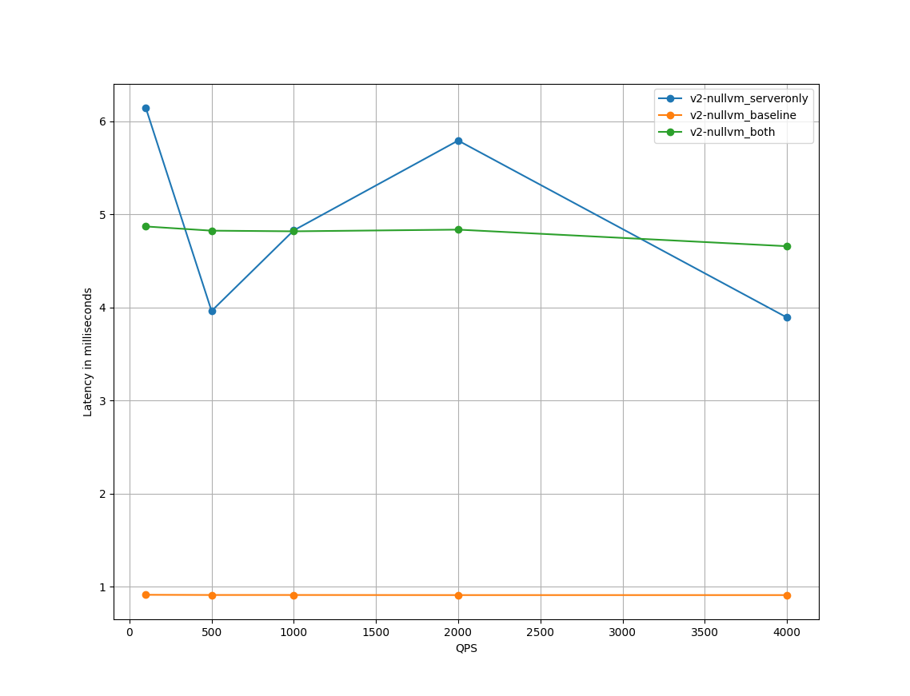

# 背景介绍

istio在应用时，会遇到的2个典型质疑是：

- istio增加了单独的数据平面，从传输的角度来说增加了2跳，势必会带来latency的增加。那么latency的增加到底是多少呢？
- proxy容器需要实现数据面的报文劫持、转发，以及一些策略的实施，其需要的cpu、内存，是多少呢？

要回答这些问题，就要对istio的数据面进行量化。
istio社区提供了一个工具来进行具体的测试：[istio tools perf benchmark](https://github.com/istio/tools/tree/master/perf/benchmark)

为什么不需要对控制面进行量化呢？主要原因是数据面是O(n)的空间复杂度，而控制面几乎是O(1)的空间复杂度。另外一个原因是目前istio的遥测、限流等策略，均为envoy实现，不再交由mixer组件处理，因此集群规模提升后对控制面来说变化不大。

# 准备

istio tools perf benchmark需要读取Pod的监控信息，因此部署istio时，需要增加Prometheus组件。具体参考[Prometheus安装](https://istio.io/latest/docs/ops/integrations/prometheus/)。

# tools install 
安装参考 [readme](https://github.com/istio/tools/tree/master/perf/benchmark)即可。

注意：
1. 资源需求比较多，要求至少32 cpu、4个node。建议使用完善的生产集群，确保硬件资源充裕。
2. 测试套依赖python3/pip3/pipenv，所以最好是在有网环境进行安装，我这里选择的是本地PC；若离线安装，可能会遇到一些镜像源获取不到的问题。
3. 不要在docker环境中安装，测试套运行过程中会使用docker执行一些命令，如果在docker中安装会执行失败。

安装后，将在namespace twopods-istio中部署2个Deployment：fortioclient/fortioserver。下面简要说明下。

## fortioclient

Deployment的编排文件请见[deployment fortioclient](fortioclient.yaml)。Pod的编排文件请见[pod fortioclient](fortioclient-54894c5758-htdgl.yaml)

来看 Pod fortioclient。其包括4个container和1个init container：

- captured：运行nighthawk客户端，客户端发出的报文会被proxy劫持
- uncaptured：运行fortio客户端，客户端发出的报文不会被proxy劫持；监听9076端口，用于托管测试生成的json文件
- shell：用于执行curl、jq等命令行
- istio-proxy：proxy，istio注入的sidecar
- init container：istio注入的init container，用于初始化iptables规则进行流量劫持。

注意Deployment 中设置的 excludeInboundPorts/excludeOutboundPorts的端口范围，8076/8077/8078/8081/端口是不走proxy的(具体查看[fortioclient iptables规则](fortioclient.iptables.log))，这里代表测试的是原生（非mesh）的性能，用于作为baseline对比；而发往8079/8080端口的报文则会被iptables劫持给proxy。

```yaml
apiVersion: apps/v1
kind: Deployment
metadata:
  name: fortioclient
  namespace: twopods-istio
..
  template:
    metadata:
      annotations:
        linkerd.io/inject: disabled
        sidecar.istio.io/inject: "true"
        sidecar.istio.io/interceptionMode: REDIRECT
        traffic.sidecar.istio.io/excludeInboundPorts: 8076,8077,8078,8081,9999
        traffic.sidecar.istio.io/excludeOutboundPorts: 80,8076,8077,8078,8081
        traffic.sidecar.istio.io/includeOutboundIPRanges: 10.222.0.0/16
```

## fortioserver

Deployment的编排文件请见[deployment fortioserver](fortioserver.yaml)。Pod的编排文件请见[pod fortioserver](fortioserver-6bc8c484d4-n2tq6.yaml)

fortioserver包括4个container和1个init container。

- captured：nighthawk-test-server服务端，发给该服务的报文会被proxy劫持。具体来说，监听8079/8080/9080端口，均被劫持。
- uncaptured：运行nighthawk-test-server服务端，发给该服务的报文**不会**被劫持。具体来说，监听8076/8077/8078端口，均被劫持。
- shell：用于执行curl、jq等命令行
- istio-proxy：proxy，istio注入的sidecar
- init container：istio注入的init container，用于初始化iptables规则进行流量劫持。

fortioserver的excludeInboundPorts/excludeOutboundPorts的配置与fortioclient是一致的。

# 测试

## 运行测试用例

runner/runner.py 用来执行测试用例。具体参数参考[run-performance-tests](https://github.com/istio/tools/tree/master/perf/benchmark#run-performance-tests)。

如下，将采用fortio作为压力源，并发连接设置为16，基准测试的qps依次设置为100,500,1000,2000,4000，每个基准测试用例持续时间为120s，遥测模式为telemetry-v2，针对如下场景进行测试：

- both: 默认值，收发两端均通过sidecar
- baseline: 基线，收发两端直连，均不通过sidecar
- serversidecar: 只有server端启用sidecar

```bash
python runner/runner.py --conn 16 --qps 100,500,1000,2000,4000 --duration 120 --serversidecar --baseline --load_gen_type=fortio --telemetry_mode=v2-nullvm
```

这样，就可以得到5 * 3 个测试数据，从而比对不同qps下，直连、全mesh、服务端mesh场景下，时延的变化情况。

测试完毕后，在fortioclient pod的shell container中的 `/var/lib/fortio/`下，会生成15个json文件，数据参考[fortio_json_data](fortio_json_data/2021-08-04-121644_a551ba6e_qps_100_c_16_1024_v2_nullvm_baseline.json)，该文件描述了本次基准测试的数据，如基准测试起始时间，P50/P90/P99，基准测试报文特征等。

> 注意，由于每次测试生成的文件都放在 `/var/lib/fortio/`，多次测试的数据会有干扰，建议测试前先清理下该目录。

## 收集指标信息

runner/fortio.py 用来收集基准测试数据、监控指标数据。具体参数参考[gather-result-metrics](https://github.com/istio/tools/tree/master/perf/benchmark#gather-result-metrics)

fortio.py依赖 fortioclient uncaptured(9076端口)、Prometheus，需要确保本地能够访问这两个地址。

我这里使用了kubectl port-forward的方式。也可以直接访问url，注意FORTIO_CLIENT_URL、PROMETHEUS_URL设置为正确的值即可。

```bash
kubectl -n twopods-istio port-forward svc/fortioclient 9076:9076 &
kubectl -n istio-system port-forward svc/prometheus 9090:9090 &

export PROMETHEUS_URL=http://localhost:9090
export FORTIO_CLIENT_URL=http://localhost:9076
```

配置好后，执行下面的命令。

```bash
python ./runner/fortio.py $FORTIO_CLIENT_URL --prometheus=$PROMETHEUS_URL --csv StartTime,ActualDuration,Labels,NumThreads,ActualQPS,p50,p90,p99,p999,cpu_mili_avg_istio_proxy_fortioclient,cpu_mili_avg_istio_proxy_fortioserver,cpu_mili_avg_istio_proxy_istio-ingressgateway,mem_Mi_avg_istio_proxy_fortioclient,mem_Mi_avg_istio_proxy_fortioserver,mem_Mi_avg_istio_proxy_istio-ingressgateway
```

fortio.py 会调用kubectl将json文件拷贝到本地的tmp目录，并依次处理目录下的json文件。

> 注意，由于每次收集指标时，拷贝的文件都放在相同的tmp 目录(macos)，多次测试的数据会有干扰，建议测试前先清理下该目录。

执行后，会生成一个json文件和一个csv文件。csv文件参考[tmpld48kepv.csv](tmpld48kepv.csv)。

通过简单的数据分析，可以发现，both/serveronly模式下，相对baseline，其P50时延增加了基本不超过5ms，P99不超过8ms。


在一些对时延要求相对宽松的场景下，增加8ms可能不是一个很致命的问题，但在一些严苛的场景（例如结算页），留给业务处理的时间可能就几十ms（包括业务逻辑、访问数据库、访问缓存），proxy增加的延迟还是比较严重的。

## 可视化

graph_plotter/graph_plotter.py 可以用来对数据进行可视化。具体参数参考[usage-and-example-plot](https://github.com/istio/tools/blob/master/perf/benchmark/graph_plotter/README.md#usage-and-example-plot)。

接上面的示例，我们设置横轴(x_axis)为qps，横轴的点为qps列表(query_list) [100,500,1000,2000,4000] ，纵轴(graph_type)为P90的延迟数据，进行绘图。

```bash
python3 ./graph_plotter/graph_plotter.py --graph_type=latency-p90 --x_axis=qps --telemetry_modes=v2-nullvm_serveronly,v2-nullvm_baseline,v2-nullvm_both --query_list=100,500,1000,2000,4000 --query_str=NumThreads==16 --csv_filepath=/var/folders/sf/ndqwtn_105n5c4pfcg9kh1rc19706f/T/tmpld48kepv.csv --graph_title=./graph_plotter/example_plot/plotter_output4.png
```

绘制图形如下，可以直观的看到both和serveronly模式相对baseline的时延增加情况。



将纵轴改为 服务端的cpu使用率 `--graph_type=cpu-server`，可以查看到随着qps的提高，pod的cpu使用率有着明显的提升。


# 总结

istio tools perf benchmark 通过比较巧妙Deployment编排，设计了baseline/serveronly/both等测试场景，能够形象的对istio 数据面进行基准测试，并对延迟、cpu使用率、内存使用率进行度量。

# Ref

- [istio tools perf benchmark](https://github.com/istio/tools/tree/master/perf/benchmark)
- [Best Practices: Benchmarking Service Mesh Performance](https://istio.io/latest/blog/2019/performance-best-practices/)

