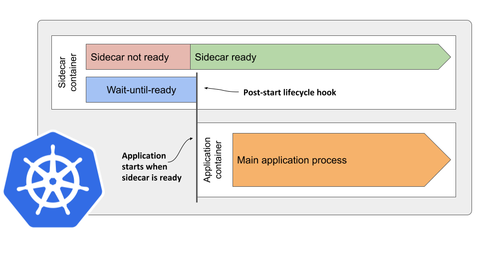

开启服务网格后，经常会遇到一个问题：如何保证sidecar容器启动并且就绪后，再启动app容器？

默认app容器和sidecar容器是同时启动的。由于init container已经先启动，并且设置了iptables规则，将流量导给了sidecar，如果app容器在sidecar容器就绪之前就启动了，可能app容器发起的网络连接会全部失败，有些应用对网络比较敏感，可能会遇到需要重启多次才能正常运行的问题。

社区有人提过 sidecar type container 的概念，即将sidecar明确作为一个特殊的container类型，其在普通container启动之前启动、在普通container停止之后停止。这样，sidecar可以为app容器提供比较稳定的运行环境。

该提议一直没有得到允许。

不过，k8s本身提供了一个机制：Pod中的container是按照出现顺序启动的，若container设置了 `post-start` 阶段，则必须等待该container执行完 `post-start` 后，才会启动下一个container。

基于此，社区有人设计了一个解决启动顺序的方案。



具体的Pod看上去如下。

```yaml
apiVersion: v1
kind: Pod
metadata:
  name: sidecar-starts-first
spec:
  containers:
  - name: sidecar
    image: my-sidecar
    lifecycle:
      postStart:
        exec:
          command:
          - /bin/wait-until-ready.sh
  - name: application
    image: my-application
```

和启动阶段不同，k8s在删除Pod时，是并行停止container的，所以关停Pod的时候，仍然是会出现 app container 网络中断的问题。

一个可能的解决办法是，在sidecar的pid 1中，响应SIGTERM信号，在SIGTERM信号处理函数中，检查 pilot-agent/envoy 被动建立的连接是否还存在，如果还存在，则表示app container还未退出，则进行等待。

当app container退出后，相应的连接会关闭，此时再关闭pilot-agent/envoy进程，可以保证app container的网络在Pod删除时可用。

Ref:

[Delaying application start until sidecar is ready](https://medium.com/@marko.luksa/delaying-application-start-until-sidecar-is-ready-2ec2d21a7b74)