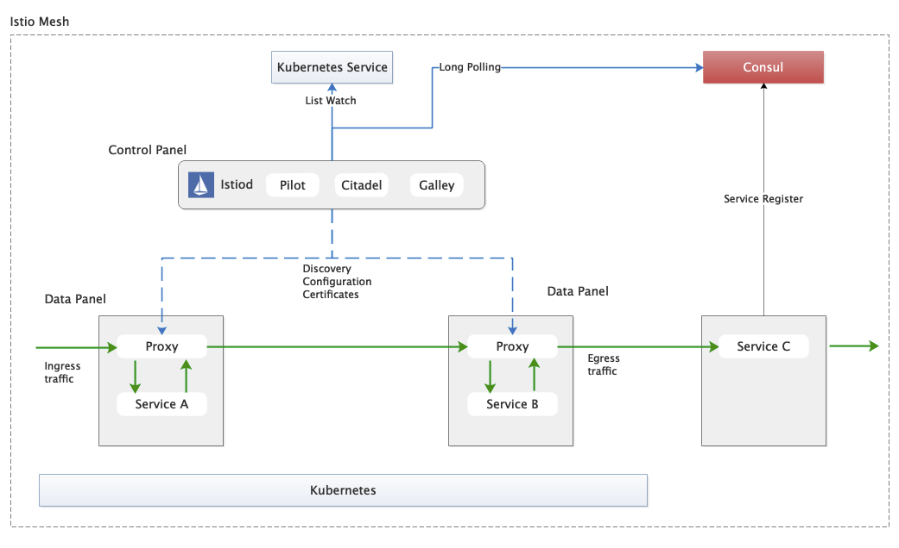
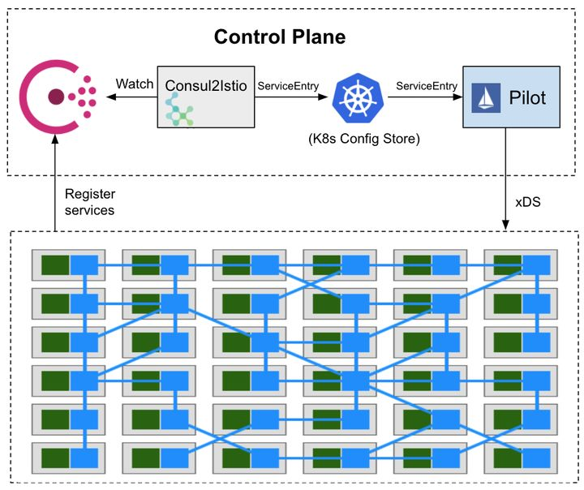

<!-- START doctoc generated TOC please keep comment here to allow auto update -->
<!-- DON'T EDIT THIS SECTION, INSTEAD RE-RUN doctoc TO UPDATE -->
**Table of Contents**  *generated with [DocToc](https://github.com/thlorenz/doctoc)*

- [注册中心](#%E6%B3%A8%E5%86%8C%E4%B8%AD%E5%BF%83)
- [注册中心接入(intree)](#%E6%B3%A8%E5%86%8C%E4%B8%AD%E5%BF%83%E6%8E%A5%E5%85%A5intree)
  - [consul 部署](#consul-%E9%83%A8%E7%BD%B2)
  - [istio配置](#istio%E9%85%8D%E7%BD%AE)
  - [验证](#%E9%AA%8C%E8%AF%81)
  - [问题/缺点](#%E9%97%AE%E9%A2%98%E7%BC%BA%E7%82%B9)
- [service entry方案](#service-entry%E6%96%B9%E6%A1%88)

<!-- END doctoc generated TOC please keep comment here to allow auto update -->

consul的基础了解，请移步[consul basic](consul-basic.md)

# 注册中心

默认istio使用k8s作为注册中心，k8s的service、endpoint对应于服务、实例。

针对一些还未接入到服务网格的Spring Cloud服务，其使用的注册中心可能是consul，如何让服务网格上的consumer服务能访问到非服务网格的Provider，是应用在服务网格迁移过程中所面临的问题。istio本身提供了一些机制，来引入外部注册中心的服务。

注意，这里强调是**未接入服务网格**，而不是**未接入k8s**。原因是，应用可以接入k8s，但未关闭Spring Cloud的治理能力，仍然是向consul发起注册。针对这种服务，实际上仍然不能进行在服务网格上进行管理。



istio在发展过程中，对于外部注册中心的支持经历了多个阶段：intree支持、MCP、MCP over XDS，最终的计划是通过UDPA接入。目前的istio代码（1.10）是MCP over XDS的方式接入，不过官方没有提供相关的实现参考。

除了将consul作为与kubernetes同级别的注册中心接入，社区还有一种思路，借助service entry，将consul上的服务映射为istio的 service entry，将consul服务的instance作为workload entry，从而帮助服务网格上的服务，去访问不在服务网格的服务。

# 注册中心接入(intree)

istio最后一个intree支持consul作为注册中心的版本是 1.7.8 。

下面记录下 1.7.8 版本使用consul作为注册中心的配置方法。

## consul 部署

consul服务以Deployment的形式，部署到k8s的default namespace下。

```yaml
apiVersion: apps/v1
kind: Deployment
metadata:
  labels:
    app: consul
  name: consul
  namespace: default
spec:
  replicas: 1
  selector:
    matchLabels:
      app: consul
  template:
    metadata:
      labels:
        app: consul
    spec:
      containers:
      - image: consul:1.8.4
        name: consul
        ports:
        - containerPort: 8500
          protocol: TCP
```

部署后，调用 `/v1/catalog/services` 可以查找到consul服务已经注册成功。

```
curl  10.102.67.37:8500/v1/catalog/services
{
    "consul": []
}
```

## istio配置

注意istio采用1.7.8版本。通过demo profile部署后，修改 registries 为Kubernetes+Consul，以及增加consul server的地址。

```yaml
istiod：
    spec:
      containers:
      - args:
        - discovery
        - --consulserverURL=10.102.67.37:8500
        - --registries=Kubernetes,Consul
        - --monitoringAddr=:15014
        - --log_output_level=default:info
```

## 验证

demo服务是一个howtodoinjava上的[example](https://howtodoinjava.com/spring-cloud/consul-service-registration-discovery/)修改而来，主要是设置了consul的地址。

将consul-student部署到default namespace下，从consul上可以查看到该服务已经注册成功。

```bash
curl  10.102.67.37:8500/v1/catalog/services
{
    "consul": [],
    "student-service": []
}
```

在istio-demo namespace下部署debian服务。由于istio-demo已经开启了istio的支持，因此部署后，debian服务的pod会注入sidecar。

登录到debian pod中，通过curl请求student服务，来模拟consumer的行为。

注意：
- istio对于从consul接入的服务，默认是自动增加 `.service.consul` 后缀，本例为 `student-service.service.consul`。
- 需要加端口号来访问，本例为consul-student指定的9098，即`student-service.service.consul:9098`。这与Spring Cloud不同，SC不需要关注Provider的端口号。
- `student-service.service.consul` 没有写入到coredns，临时通过修改pod的 `/etc/hosts` 文件来解决，随便为其指定一个ip地址，目的是将流量导给envoy。`echo "1.1.1.1 student-service" >> /etc/hosts`

curl请求可以成功：

```bash
[root@debian-77dc9c5f4f-vvxq4 /]# curl student-service.service.consul:9098/getStudentDetailsForSchool/abcschool
[{"name":"Sajal","className":"Class IV"},{"name":"Lokesh","className":"Class V"}]
```


## 问题/缺点

问题：
更新pod instance后，sidecar不更新数据。

缺点：
即使是consul部分service/instance更新，istiod也是全量更新


# service entry方案

针对consul开发controller，watch consul的service变化，并为service 生成 service entry ，为 service 的 instances 生成 workload entry。

社区有[consul2istio](https://github.com/aeraki-framework/consul2istio)项目，实现了从consul同步到istio的service entry的功能。

不过，该项目将instance直接作为service entry的endpoints，而不是为instance创建对应的wle，所以无法根据wle的label，选择不同的wle，这样会在做流量治理时遇到一些问题：例如无法为不同版本的instance设置流量治理规则，进行灰度发布。

如下是对接consul后，consul2istio创建的service entry，可以看到其 hosts 自动增加了 `.service.consul` 后缀。

```
apiVersion: networking.istio.io/v1beta1
kind: ServiceEntry
metadata:
  labels:
    manager: Aeraki
    registry: consul
  name: student-service.service.consul
  namespace: istio-system
spec:
  endpoints:
  - address: 10.244.6.42
    labels: {}
    locality: dc1
    ports:
      tcp: 9098
  hosts:
  - student-service.service.consul
  location: MESH_INTERNAL
  ports:
  - name: tcp
    number: 9098
    protocol: TCP
    targetPort: 9098
  resolution: STATIC
```



在istio本身接入注册中心的机制仍然在快速演变的情况下，`consul2istio`的思路其实挺值得借鉴的。另外，`consul2istio`可以实现增量更新（watch consul变化、每个service entry单独更新）。


<!-- 接入注册中心的机制每次是所有服务和实例全量push， -->

<!-- ## 实现分析（working）

控制流上来看，istio-discovery会调用consul的api，来获取service及instance，并将其下发给envoy。

consul的数据

```
10.102.67.37:8500/v1/catalog/services
10.102.67.37:8500/v1/catalog/service/student-service
        "ServiceName": "student-service",
        "ServicePort": 9098,
```

入口
pilot/pkg/bootstrap/servicecontroller.go:38
```go
		case serviceregistry.Consul:
			if err := s.initConsulRegistry(serviceControllers, args); err != nil {
				return err
			}
```

pilot/pkg/bootstrap/servicecontroller.go:105
```go
func (s *Server) initConsulRegistry(serviceControllers *aggregate.Controller, args *PilotArgs) error {
	log.Infof("Consul url: %v", args.RegistryOptions.ConsulServerAddr)
	controller, err := consul.NewController(args.RegistryOptions.ConsulServerAddr, "")
	if err != nil {
		return fmt.Errorf("failed to create Consul controller: %v", err)
	}
	serviceControllers.AddRegistry(controller)

	return nil
}
```

pilot/pkg/serviceregistry/aggregate/controller.go:103
聚合service
```go
// Services lists services from all platforms
func (c *Controller) Services() ([]*model.Service, error) {
	for _, r := range c.GetRegistries() {
		svcs, err := r.Services()
```

总入口
pilot/pkg/model/push_context.go:1020

```go
	out := &model.Service{
		Hostname:     hostname,
		Address:      "0.0.0.0",
		Ports:        svcPorts,
		MeshExternal: meshExternal,
		Resolution:   resolution,
		Attributes: model.ServiceAttributes{
			ServiceRegistry: string(serviceregistry.Consul),
			Name:            string(hostname),
			Namespace:       model.IstioDefaultConfigNamespace,
		},
	}
```

[bottle@optiplex-1 screen default]$ curl  10.102.67.37:8500/v1/catalog/services
{
    "consul": [],
    "student-service": []
}
[bottle@optiplex-1 screen default]$ curl  10.102.67.37:8500/v1/catalog/service/student-service
```json
[
    {
        "ID": "0b617f2a-58d6-3779-268a-8583f1d56e1f",
        "Node": "consul-6c464f5d4b-gv52l",
        "Address": "127.0.0.1",
        "Datacenter": "dc1",
        "TaggedAddresses": {
            "lan": "127.0.0.1",
            "lan_ipv4": "127.0.0.1",
            "wan": "127.0.0.1",
            "wan_ipv4": "127.0.0.1"
        },
        "NodeMeta": {
            "consul-network-segment": ""
        },
        "ServiceKind": "",
        "ServiceID": "student-service-2f93680e1872b0d690e48f9742a203ad",
        "ServiceName": "student-service",
        "ServiceTags": [],
        "ServiceAddress": "10.244.6.42",
        "ServiceTaggedAddresses": {
            "lan_ipv4": {
                "Address": "10.244.6.42",
                "Port": 9098
            },
            "wan_ipv4": {
                "Address": "10.244.6.42",
                "Port": 9098
            }
        },
        "ServiceWeights": {
            "Passing": 1,
            "Warning": 1
        },
        "ServiceMeta": {},
        "ServicePort": 9098,
        "ServiceEnableTagOverride": false,
        "ServiceProxy": {
            "MeshGateway": {},
            "Expose": {}
        },
        "ServiceConnect": {},
        "CreateIndex": 30806,
        "ModifyIndex": 30806
    }
]
``` -->

