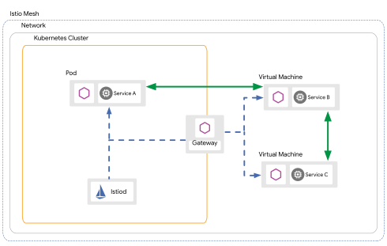

> 本文基于istio 1.10版本。

# 从虚拟机访问服务网格上的应用

在前文[access workload on virtual machine by service entry](service-entry.md)中，说明了如何通过`service entry/workload entry/dns proxy`来从服务网格内访问在虚拟机上的服务。那么如何在虚拟机上，访问服务网格上的服务呢？

要解决这个问题，首先要分析，Kubernetes为istio提供了哪些能力，而这些能力是虚拟机上所没有的。Kubernetes为istio提供了服务发现（基于kuberne service）、DNS解析（kube-dns/corends）、健康检查（kubelet）。要在虚拟机上对齐这些能力，就需要istio本身来支持。

istio提供了一个方案：在虚拟机上部署sidecar（主要是pilot-agent和envoy），并且修改虚拟机的iptables，从而达到与Kubernetes上类似的架构，这样就可以在虚拟机上劫持应用的流量，交给envoy来进行流量治理、安全增强、遥测等。


# 架构

如图，部署在虚拟机上的 服务B/C，通过同样部署在虚拟机上的sidecar，建立与istiod的连接(by gateway or istiod service)，进行服务注册和发现；虚拟机上的 服务B/C ，会通过sidecar，与服务网格上的Pod可以互访。

注意，当前架构将虚拟机和Pod等同处理，也就是说，客户端和服务端，可能是虚拟机、Pod的任意形式。这样就存在客户端在虚拟机，服务端在Pod，因此，要求Pod的IP是可以从集群外连接到。



# 自动注册workload entry

istio提供了 workload group 的概念，支持将虚拟机上的服务，自动注册为workload entry。

workload group 可以理解为一批有共同特性的虚拟机工作负载。从概念上来说，workload group类比为Kubernetes Deployment，而workload entry类比为 Kubernetes Pod。

用户可以在namespace下创建 workload group，并在虚拟机上的配置上指定 `ISTIO_META_AUTO_REGISTER_GROUP` 为 workload group的名字，这样istiod会自动创建workload entry。

那么如何实现虚拟机和Pod容器等同访问呢？

第一个方法是通过Kubernetes service，具体可以参考官方文档的示例。

第二个方法是通过istio service entry。service entry可以根据label选择Pod和workload entry。如前所述，Pod和workload entry都是可以自动创建的，并且istio的service entry目前的支持也比较到位了（如域名解析等），不会像Kubernetes service占用用户的一些资源，本文中会以service entry来进行说明。

## 开启

istio默认不会开启workload entry自动注册。

开启workload entry 需要在 Deployment istiod 的环境变量设置 `PILOT_ENABLE_WORKLOAD_ENTRY_AUTOREGISTRATION` 和 `PILOT_ENABLE_WORKLOAD_ENTRY_HEALTHCHECKS` 为 true。

同时，为虚拟机上的workload生成配置文件时，也需要设置 `--autoregister`，这样虚拟机的istio服务启动后，istiod才会自动创建workload entry。

# 部署步骤记录

下面简要记录下部署步骤，详细参考[here](https://istio.io/latest/docs/setup/install/virtual-machine/#create-files-to-transfer-to-the-virtual-machine)。


1、 在虚拟机上export如下环境变量。

```bash
VM_APP="<the name of the application this VM will run>"
VM_NAMESPACE="<the name of your service namespace>"
WORK_DIR="<a certificate working directory>"
SERVICE_ACCOUNT="<name of the Kubernetes service account you want to use for your VM>"
CLUSTER_NETWORK=""
VM_NETWORK=""
CLUSTER="Kubernetes"
```

这里仍然选择使用namespace `istio-demo`，service account名为`vm`。注意CLUSTER_NETWORK和VM_NETWORK留空即可。如下是一个示例。

```bash
export VM_APP="nginx"
export VM_NAMESPACE="istio-demo"
export WORK_DIR="/home/bottle/istio/vm"
export SERVICE_ACCOUNT="vm"
export CLUSTER_NETWORK=""
export VM_NETWORK=""
export CLUSTER="Kubernetes"
```

2、创建namespace `istio-demo`，在该namespace下创建sa `vm`。

3、创建文件 `workloadgroup.yaml` ，并在mesh机器上，生成虚拟机上安装sidecar的相关文件。

```yaml
$ cat <<EOF > workloadgroup.yaml
apiVersion: networking.istio.io/v1alpha3
kind: WorkloadGroup
metadata:
  name: "${VM_APP}"
  namespace: "${VM_NAMESPACE}"
spec:
  metadata:
    labels:
      app: "${VM_APP}"
  template:
    serviceAccount: "${SERVICE_ACCOUNT}"
    network: "${VM_NETWORK}"
  probe:
    httpGet:
      port: 80
EOF
$ kubectl apply -f workloadgroup.yaml
$ kubectl get svc -n istio-system istiod
NAME     TYPE           CLUSTER-IP     EXTERNAL-IP    PORT(S)                                                         AGE
istiod   LoadBalancer   10.98.96.243   192.168.0.59   15010:31196/TCP,15012:30204/TCP,443:32366/TCP,15014:32192/TCP   2d3h
$ 
$ istioctl x workload entry configure -f workloadgroup.yaml -o "${WORK_DIR}" --clusterID "${CLUSTER}" --ingressIP 192.168.0.59 --autoregister
```

生成的文件可以参考 vm-with-sidecar 目录下的文件。其中hosts指定了 `istiod.istio-system.svc` 的地址，而在服务网格上的sidecar，也是通过这个域名访问istiod的，只是其域名解析是通过kube-dns/coredns完成的。

> 相比官方文档，这里略过了 servie istiod 的集群外访问方式配置。官方文档说明是用gateway来进行集群外访问，由于我的集群的load balancer类型的svc，是可以从集群外直接访问external IP的，所以在上面通过`--ingressIP`直接指定了istiod的IP地址。

> 相比官方文档，这里增加了`--autoregister` 配置，这样生成的`cluster.env`和`mesh.yaml`会增加`ISTIO_META_AUTO_REGISTER_GROUP='nginx'`配置，这些配置会在虚拟机的proxy sidecar与istiod连接的时候报上去。

4、虚拟机上配置mesh相关配置文件

*修改cluster.env文件，`ISTIO_METAJSON_LABELS`改为如下值，主要是增加label`"class":"vm"`，下面配置流量治理规则的时候需要用到。*

```
ISTIO_METAJSON_LABELS='{"app":"nginx","class":"vm","service.istio.io/canonical-name":"nginx","service.istio.io/canonical-version":"latest"}'
```

将步骤3生成的文件，拷贝到虚拟机上。

虚拟机上的操作主要参考 [configure-the-virtual-machine](https://istio.io/latest/docs/setup/install/virtual-machine/#configure-the-virtual-machine)，记录如下。

```bash
$ sudo mkdir -p /etc/certs
$ sudo cp root-cert.pem  /etc/certs/root-cert.pem
$ sudo  mkdir -p /var/run/secrets/tokens
$ sudo cp istio-token /var/run/secrets/tokens/istio-token
$ curl -LO https://storage.googleapis.com/istio-release/releases/1.10.0/deb/istio-sidecar.deb
$ sudo dpkg -i istio-sidecar.deb
$ sudo cp cluster.env  /var/lib/istio/envoy/cluster.env
$ sudo cp mesh.yaml  /etc/istio/config/mesh
$ sudo sh -c 'cat hosts  >> /etc/hosts'
$ sudo chown -R istio-proxy /var/lib/istio /etc/certs /etc/istio/proxy /etc/istio/config /var/run/secrets /etc/certs/root-cert.pem
$ sudo systemctl start istio
```

虚拟机上的istio启动后，查看进程可以看到pilot-agent和envoy。

```
istio-p+   54820  0.0  0.1  18548  9664 ?        Ss   16:00   0:00 /lib/systemd/systemd --user
istio-p+   54821  0.0  0.0 172064  4736 ?        S    16:00   0:00 (sd-pam)
istio-p+   54826  0.0  0.5 743480 41840 ?        Ssl  16:00   0:01 /usr/local/bin/pilot-agent proxy
istio-p+   54832  0.3  0.7 181672 64560 ?        Sl   16:00   0:04 /usr/local/bin/envoy -c etc/istio/proxy/envoy-rev0.json --restart-epoch 0 --drain-time-s 45 --drain-strategy immediate --parent-shutdown-tim
```

查看日志文件 `/var/log/istio/istio.log`，可以看到pilot-agent的日志 `connected to upstream XDS server`。


```
2021-05-21T16:00:38.243149Z     info    sds     SDS: PUSH       resource=ROOTCA
2021-05-21T16:00:38.243204Z     info    sds     SDS: PUSH       resource=default
2021-05-21T16:00:38.243256Z     info    cache   returned workload trust anchor from cache       ttl=23h59m59.756746488s
2021-05-21T16:00:38.243775Z     info    sds     SDS: PUSH       resource=ROOTCA
2021-05-21T16:31:55.336107Z     info    xdsproxy        connected to upstream XDS server: istiod.istio-system.svc:15012
```

5、验证

由于前面开启了workload entry的自动注册，所以在控制面上可以看到自动创建的 wle nginx-192.168.0.204，其中的`ownerReferences`指明了关联的wlg。

```yaml
apiVersion: networking.istio.io/v1beta1
kind: WorkloadEntry
metadata:
  annotations:
    istio.io/autoRegistrationGroup: nginx
    istio.io/connectedAt: "2021-05-22T13:54:10.93951642Z"
    istio.io/workloadController: istiod-77f7575d96-mxqxj
  generation: 1
  labels:
    app: nginx
    class: vm
    service.istio.io/canonical-name: nginx
    service.istio.io/canonical-version: latest
  name: nginx-192.168.0.204
  namespace: istio-demo
  ownerReferences:
  - apiVersion: networking.istio.io/v1alpha3
    controller: true
    kind: WorkloadGroup
    name: nginx
    uid: 5851164e-415d-4dd9-b0a8-27a9942a7995
spec:
  address: 192.168.0.204
  labels:
    app: nginx
    class: vm
    service.istio.io/canonical-name: nginx
    service.istio.io/canonical-version: latest
  serviceAccount: vm
```

创建 service entry nginx，其label为`app=nginx`，从而选中上面自动创建的workload entry。

```yaml
apiVersion: networking.istio.io/v1alpha3
kind: ServiceEntry
metadata:
  name: nginx
  namespace: istio-demo
spec:
  hosts:
  - nginx.jd.com
  location: MESH_INTERNAL
  ports:
  - name: http
    number: 80
    protocol: HTTP
  resolution: STATIC
  workloadSelector:
    labels:
      app: nginx
```

登录到namespace istio-demo 服务网格上的debian Pod，请求 `curl nginx.jd.com`，可以看到返回的是虚拟机上的`Welcome to nginx on vm204!`。

接下来验证下通过service entry来统一管理虚拟机和Pod容器上的workload。

创建 Deploymen nginx。注意，这里为Pod增加了label `class=docker`。

```yaml
apiVersion: apps/v1
kind: Deployment
metadata:
  labels:
    app: nginx
  name: nginx
  namespace: istio-demo
spec:
  selector:
    matchLabels:
      app: nginx
  template:
    metadata:
      labels:
        app: nginx
        class: docker
    spec:
      containers:
      - image: nginx
        name: nginx
```

由于需要验证的是**从虚拟机访问服务网格的服务**，所以登录到虚拟机上，请求 `curl nginx.jd.com`，可以看到返回的是虚拟机和容器的不同内容，说明 虚拟机能够通过service entry，访问不同部署形式的workload。

这是怎么发生的呢？

sidecar在虚拟机上部署后，会下发iptables 规则，劫持DNS请求的报文给 pilot-agent ；由于pilot-agent目前内置了dns服务器，与容器上的实现类似，其会给 service entry 的hosts分配一个虚拟IP地址（如下 240.240.0.2）。


```bash
# iptables-save  //仅DNS相关表项
-A OUTPUT -p tcp -j ISTIO_OUTPUT
-A OUTPUT -p udp -m udp --dport 53 -m owner --uid-owner 113 -j RETURN
-A OUTPUT -p udp -m udp --dport 53 -m owner --gid-owner 113 -j RETURN
-A OUTPUT -d 127.0.0.53/32 -p udp -m udp --dport 53 -j REDIRECT --to-ports 15053
-A ISTIO_OUTPUT ! -d 127.0.0.1/32 -o lo -p tcp -m tcp ! --dport 53 -m owner --uid-owner 113 -j ISTIO_IN_REDIRECT
# netstat -antpu |grep 15053
tcp        0      0 127.0.0.1:15053         0.0.0.0:*               LISTEN      111679/pilot-agent
udp        0      0 127.0.0.1:15053         0.0.0.0:*                           111679/pilot-agent
# ping nginx.jd.com
PING nginx.jd.com (240.240.0.2) 56(84) bytes of data.
# curl nginx.jd.com
Welcome to nginx on vm204!
```

如上，可以验证，isito目前已经支持虚拟机加入到服务网格，进行统一治理。


当然，由于上面istiod自动创建了workload entry（区别于管理员手动创建wle），因此也实现了从容器里请求网格上的容器+虚拟机资源的需求。

登录到debian Pod，请求 `curl nginx.jd.com`，可以看到返回的是虚拟机和容器的不同内容，说明 service entry能够统一管理不同部署形式的workload。

同样的，也可以配置virtual service和destination rule，将流量全部导到虚拟机。

```yaml
apiVersion: networking.istio.io/v1alpha3
kind: DestinationRule
metadata:
  namespace: istio-demo
  name: nginx-dr
spec:
  host: nginx.jd.com
  subsets:
    - name: vm
      labels:
        class: vm
    - name: docker
      labels:
        class: docker
---
apiVersion: networking.istio.io/v1alpha3
kind: VirtualService
metadata:
  namespace: istio-demo
  name: nginx-vs
spec:
  hosts:
    - nginx.jd.com
  http:
    - name: http-nginx-route
      route:
        - destination:
            host: nginx.jd.com
            subset: vm
          weight: 100
        - destination:
            host: nginx.jd.com
            subset: docker
          weight: 0
```

如上，virtual service将流量 100% 导向了 subset vm的destination，也就是label为 `class=vm` 的workload。此时从debian pod请求`curl nginx.jd.com`，返回的总是虚拟机上的`Welcome to nginx on vm204!`。

# 总结

istio给出的虚拟机解决方案，目前看是比较完整的：从虚拟机访问网格服务，从网格访问虚拟机服务，都能够支持，并且能够做到一定的自动化。

